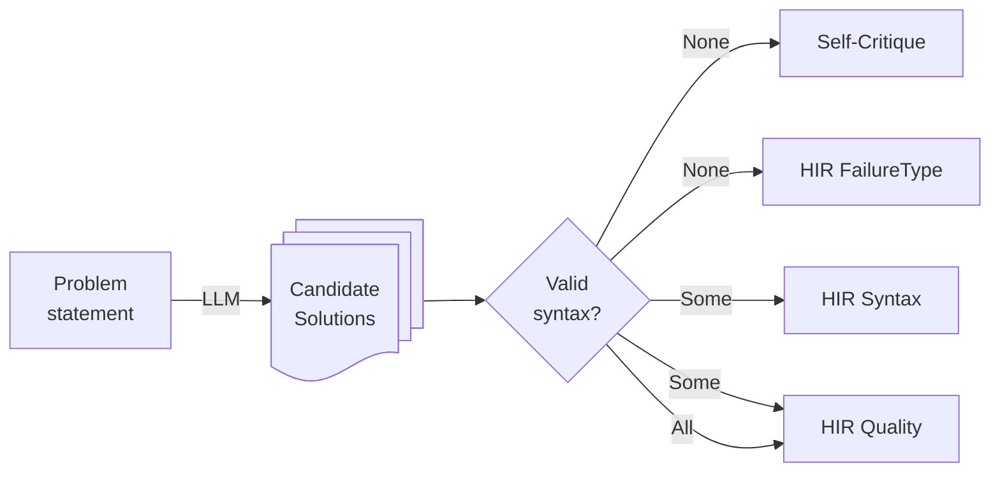
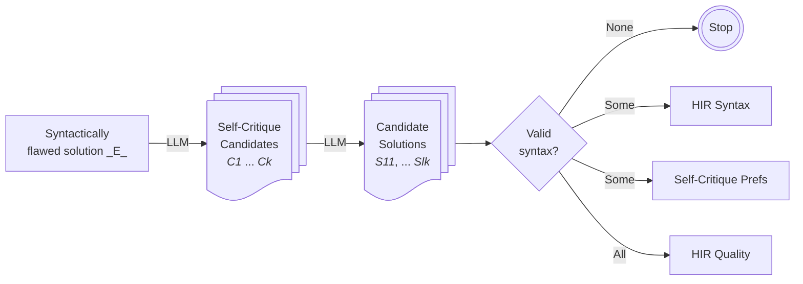

# argdown-hirp
Hindsight Instruction Relabeling Preferences




How does Self-Critique work?



Pseudo code:

```python
problem_statement: str
flawed_solution: str

self_critique_candidates = []

for i in range(k):
    self_critique = llm_criticize(problem_statement, flawed_solution)

    refined_solutions = []
    for j in range(l):
        refined_solution = llm_solve(problem_statement, flawed_solution, self_critique)
        is_valid = parse(refined_solution)
        refined_solutions.append({"a": refined_solution, "valid": is_valid})

    # this could also be probabilistic choice
    if all(rs in refined_solutions is valid):
        create_hir_quality_pair(problem_statement, flawed_solution, self_critique, refined_solutions)
    elif any(rs in refined_solutions is valid):
        create_hir_syntax_pair(problem_statement, flawed_solution, self_critique, refined_solutions)

    self_critique_candidates.append({"a": self_critique, "v_score": mean(rs.valid in refined_solutions))

best_self_critique = argmax(self_critique_candidates, v_score)
worst_self_critique = argmin(self_critique_candidates, v_score)

shortest_self_critique = argmax(self_critique_candidates, v_score)
longest_self_critique = argmin(self_critique_candidates, v_score)


if best_self_critique.vscore >> worst_self_critique.vscore:
    create_self_critique_pair(problem_statement, flawed_solution, best_self_critique, worst_self_critique)
elif (
        len(shortest_self_critique) << len(longest_self_critique) and
        shortest_self_critique.vscore ~ longest_self_critique.vscore and
        shortest_self_critique.vscore > threshold
    ):
    create_self_critique_pair(problem_statement, flawed_solution, shortest_self_critique, longest_self_critique)

```
