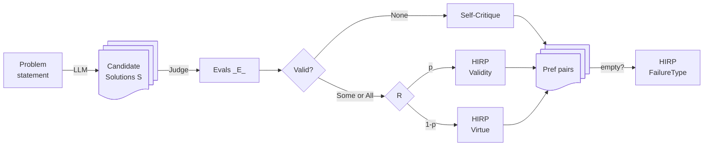
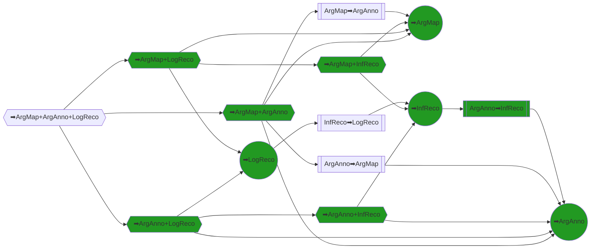

# argdown-hirpo

Hindsight Instruction Relabeling Preferences

### Main preference generation workflow



### How does Self-Critique work?


### Symmetric HIRP (illustration of key idea)

```markdown
1. Problem statement: p
2. Candidate solutions: s1, s2
3. Judge: s1 valid, s2 invalid
4. HIRP pairs:
   - prompt: Solve p!
     chosen: s1
     rejected s2
   - prompt: Present **invalid** solution to p!
     chosen: s2
     rejected: s1
```

### DAG




