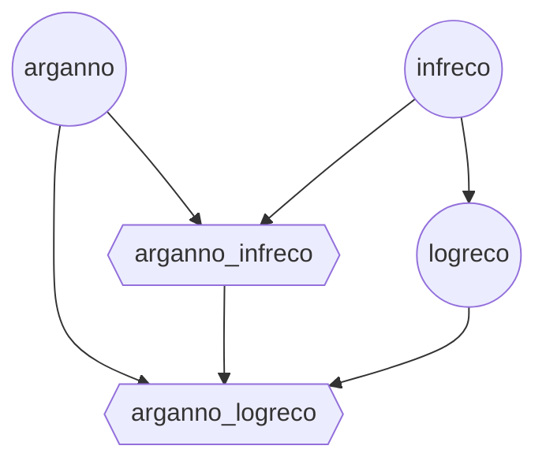
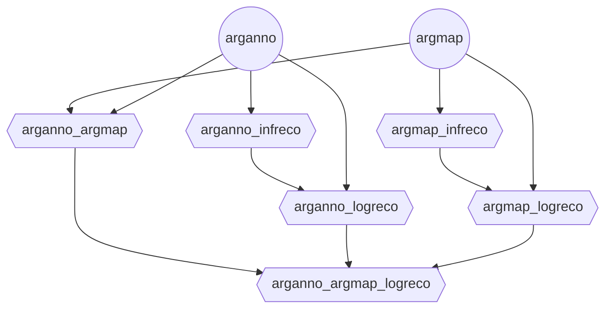

# Argdown Analysis Environment

An OpenEnv environment for training and evaluating agents on multi-step argument analysis tasks using Argdown notation. The environment guides agents through complex reasoning workflows, providing verification feedback at each step.

**Key Features:**
- **Zero-parameter reset**: Automatic task and source text sampling
- **Multi-dataset support**: Combine multiple HuggingFace datasets per task
- **YAML configuration**: Flexible task weights and dataset sources
- **Three deployment modes**: Docker (baked/mounted configs), Python/uv

---

## Table of Contents

1. [Quick Start](#quick-start)
2. [Configuration](#configuration)
3. [Environment Behavior](#environment-behavior)
4. [Task Workflows](#task-workflows)
5. [Python Client Usage](#python-client-usage)
6. [Advanced Usage](#advanced-usage)
7. [Troubleshooting](#troubleshooting)
8. [Development & Testing](#development--testing)

---

## Quick Start

### Option 1: Docker with Default Configuration (Recommended)

```bash
# Build the Docker image
docker build -f src/envs/argdown_analysis/server/Dockerfile -t openenv-argdown-analysis:latest .
# or with ghcr:
# docker pull ghcr.io/debatelab/openenv-argdown-analysis:latest

# Run the container
docker run -p 8000:8000 openenv-argdown-analysis:latest
# or with ghcr.io:
# docker run -p 8000:8000 ghcr.io/debatelab/openenv-argdown-analysis:latest

# Connect from Python
python -c "
from envs.argdown_analysis import ArgdownAnalysisEnv
env = ArgdownAnalysisEnv(base_url='http://localhost:8000')
result = env.reset()
print(result.observation.prompt)
"
```

### Option 2: Docker with Custom Configuration (Volume Mount)

```bash
# Create custom config
cat > my-config.yaml << EOF
SingleArgumentAnalysis:
  weight: 0.7
  datasets:
    - path: debatelab/single-argument-texts
      subset: null
      split: train

MultiArgumentAnalysis:
  weight: 0.3
  datasets:
    - path: debatelab/multi-argument-texts
      subset: null
      split: train
EOF

# Run with mounted config
docker run -p 8000:8000 \
  -v $(pwd)/my-config.yaml:/app/config/custom.yaml \
  -e ARGDOWN_CONFIG_PATH=/app/config/custom.yaml \
  openenv-argdown-analysis:latest
```

### Option 3: Python/uv run (Development)

```bash
# Set config path (optional)
export ARGDOWN_CONFIG_PATH=/path/to/custom.yaml

# Run server directly
cd src/envs/argdown_analysis
uv run server

# Or with custom port
uv run server --port 8001
```

---

## Configuration

### Configuration Format

The environment uses YAML files to define task weights and dataset sources:

```yaml
<TaskName>:
  weight: <float>      # Relative probability (normalized automatically)
  datasets:            # List of datasets (concatenated for uniform sampling)
    - path: <str>      # HuggingFace Hub dataset path
      subset: <str|null> # Dataset subset/configuration (optional)
      split: <str>     # Dataset split ('train', 'test', 'validation')
    - path: <str>      # Additional dataset (optional)
      subset: <str|null>
      split: <str>
```

### Multiple Datasets Per Task

You can combine multiple datasets for richer training:

```yaml
SingleArgumentAnalysis:
  weight: 0.6
  datasets:
    - path: debatelab/single-argument-texts
      subset: null
      split: train
    - path: debatelab/philosophy-arguments
      subset: null
      split: train
    - path: debatelab/political-arguments
      subset: null
      split: train
```

The environment will:
1. Load all datasets at initialization
2. Concatenate them into a single pool
3. Sample uniformly across all examples

### Available Configurations

Pre-configured files in `configs/`:

- **`default.yaml`**: 50% single-argument, 50% multi-argument
- **`long.yaml`**: 50% single-argument, 50% multi-argument, longer source texts
- **`single_only.yaml`**: 100% single-argument focus

### Dataset Requirements

Datasets must have a text field with one of these names:
- `text`
- `source_text`
- `content`
- `document`
- `passage`

### Environment Variables

| Variable | Default | Description |
|----------|---------|-------------|
| `ARGDOWN_CONFIG_PATH` | `configs/default.yaml` | Path to YAML configuration file |
| `HF_DATASETS_CACHE` | HuggingFace default | Custom cache directory for datasets (improves startup with Docker) |
| `MAX_RETRIES` | `3` | Maximum retry attempts for API calls |
| `TIMEOUT` | `30.0` | Request timeout in seconds |
| `BACKOFF_FACTOR` | `2.0` | Exponential backoff multiplier |

### Dataset Caching

By default, HuggingFace datasets are cached in `~/.cache/huggingface/datasets`. In Docker containers, this means:
- Each new container downloads datasets from scratch
- Cache is lost when container stops

**For production use with Docker, mount a persistent cache volume:**

```bash
# Create host cache directory
mkdir -p /data/huggingface-cache

# Run with shared cache (multiple containers can share this)
docker run -p 8000:8000 \
  -e HF_DATASETS_CACHE=/cache \
  -v /data/huggingface-cache:/cache \
  openenv-argdown-analysis:latest
```

**Benefits:**
- ✅ Datasets downloaded once, reused across all containers
- ✅ Fast subsequent container starts (no re-download)
- ✅ Supports parallel containers (HuggingFace handles locking)
- ✅ Efficient disk usage

**For Kubernetes/Docker Compose:**

```yaml
# docker-compose.yml
services:
  argdown-env:
    image: ghcr.io/debatelab/openenv-argdown-analysis:latest
    ports:
      - "8000:8000"
    environment:
      - HF_DATASETS_CACHE=/cache
    volumes:
      - hf-cache:/cache

volumes:
  hf-cache:
```

---

## Environment Behavior

### Episode Initialization (reset)

The `reset()` method takes **zero parameters** and:
1. Randomly samples a task type based on configured weights
2. Randomly samples a source text from the corresponding HuggingFace datasets
3. Initializes the first subtask in the analysis workflow
4. Returns an observation with instructions

```python
from envs.argdown_analysis import ArgdownAnalysisEnv

env = ArgdownAnalysisEnv(base_url="http://localhost:8000")
result = env.reset()  # No parameters needed!
print(result.observation.prompt)
# > "Please provide an informal argument reconstruction..."

# Check what was sampled
state = env.state()
print(f"Task: {state.task_id.value}")  # SingleArgumentAnalysis or MultiArgumentAnalysis
print(f"Source: {state.source_text}")  # Randomly sampled text
```

### Episode Flow

Each episode involves multiple verification steps following task-specific workflows (see diagrams below).

## Tasks

Every node is a subtask that needs to be solved before the agent can proceed with the next node.

Once a subtask is completed, the environment chooses randomly a child node as next sub-task to solve.

### Single-Argument Analysis




```yaml
arganno:
    - arganno_infreco
    - arganno_logreco
infreco:
    - logreco
    - arganno_infreco
logreco: 
    - arganno_logreco
arganno_infreco:
    - arganno_logreco
```

### Multi-Argument-Analysis




```yaml
arganno:
    - arganno_argmap
    - arganno_infreco
    - arganno_logreco
argmap:
    - arganno_argmap
    - argmap_infreco
    - argmap_logreco
arganno_argmap:
    - arganno_argmap_logreco
arganno_infreco:
    - arganno_logreco
arganno_logreco:
    - arganno_argmap_logreco
argmap_infreco:
    - argmap_logreco
argmap_logreco:
    - arganno_argmap_logreco
```

---

---

## Python Client Usage

### Basic Connection

```python
from envs.argdown_analysis import ArgdownAnalysisEnv, ArgdownAnalysisAction

# Connect to running server
env = ArgdownAnalysisEnv(base_url="http://localhost:8000")

# Reset environment (no parameters needed)
result = env.reset()
print(result.observation.prompt)

# Check what was sampled
state = env.state()
print(f"Task: {state.task_id.value}")
print(f"Source text: {state.source_text}")
print(f"Subtask: {state.subtask_id}")

# Step through environment
action = ArgdownAnalysisAction(
    message="<think>Analyzing the argument...</think>\n"
            "```argdown\n"
            "<Arg1>: Main argument\n"
            "  (1) First premise\n"
            "  (2) Second premise\n"
            "  ----\n"
            "  (3) Conclusion\n"
            "```"
)

result = env.step(action)
print(f"Reward: {result.reward}")
print(f"Done: {result.done}")
print(result.observation.prompt)
```

### Using from_docker_image()

Automatically start a Docker container:

```python
from envs.argdown_analysis import ArgdownAnalysisEnv

# Start container and connect
env = ArgdownAnalysisEnv.from_docker_image("ghcr.io/debatelab/openenv-argdown-analysis:latest")

# Use normally
result = env.reset()
result = env.step(action)

# Clean up
env.close()
```

**Note:** Volume mounting for custom configs is not yet supported via `from_docker_image()`. For custom configs, use `docker run` with `-v` flag.

### Episode Loop

```python
env = ArgdownAnalysisEnv(base_url="http://localhost:8000")

for episode in range(10):
    result = env.reset()
    done = False
    total_reward = 0.0
    
    while not done:
        # Your agent policy here
        action = get_action(result.observation.prompt)
        
        result = env.step(action)
        total_reward += result.reward
        done = result.done
        
    print(f"Episode {episode + 1}: Total reward = {total_reward:.2f}")
```

### Accessing Episode State

```python
# Get full state
state = env.state()

print(f"Episode ID: {state.episode_id}")
print(f"Step count: {state.step_count}")
print(f"Task: {state.task_id.value}")
print(f"Current subtask: {state.subtask_id}")
print(f"Source text: {state.source_text}")
print(f"Completed subtasks: {state.subtasks_completed}")

# Access history
for step in state.history:
    print(f"\nSubtask: {step.subtask_id}")
    print(f"Prompt: {step.prompt[:100]}...")
    if step.verification_response:
        print(f"Valid: {step.verification_response.get('is_valid')}")
```

---

## Advanced Usage

### Production Deployment

For production, use multiple workers:

```bash
docker run -p 8000:8000 \
  -e UVICORN_WORKERS=4 \
  ghcr.io/debatelab/openenv-argdown-analysis:latest
```

Or modify the CMD in Dockerfile:
```dockerfile
CMD ["uvicorn", "argdown_analysis.server.app:app", "--host", "0.0.0.0", "--port", "8000", "--workers", "4"]
```

### Health Checks

The environment includes a health endpoint:

```bash
curl http://localhost:8000/health
# {"status": "healthy"}
```

Use in Docker Compose:
```yaml
services:
  argdown-env:
    image: ghcr.io/debatelab/openenv-argdown-analysis:latest
    ports:
      - "8000:8000"
    healthcheck:
      test: ["CMD", "curl", "-f", "http://localhost:8000/health"]
      interval: 30s
      timeout: 3s
      retries: 3
      start_period: 5s
```

### Custom Dataset Upload

1. **Upload to HuggingFace Hub:**
```bash
huggingface-cli login
huggingface-cli repo create my-argument-dataset --type dataset
# Upload your dataset files
```

2. **Configure in YAML:**
```yaml
SingleArgumentAnalysis:
  weight: 1.0
  datasets:
    - path: your-username/my-argument-dataset
      subset: null
      split: train
```

### Example Configurations

**Balanced Training:**
```yaml
SingleArgumentAnalysis:
  weight: 0.5
  datasets:
    - path: debatelab/single-argument-texts
      subset: null
      split: train

MultiArgumentAnalysis:
  weight: 0.5
  datasets:
    - path: debatelab/multi-argument-texts
      subset: null
      split: train
```

**Evaluation Mode:**
```yaml
SingleArgumentAnalysis:
  weight: 0.6
  datasets:
    - path: debatelab/single-argument-texts
      subset: null
      split: test  # Use test split

MultiArgumentAnalysis:
  weight: 0.4
  datasets:
    - path: debatelab/multi-argument-texts
      subset: null
      split: test
```

**Multi-Source Training:**
```yaml
SingleArgumentAnalysis:
  weight: 1.0
  datasets:
    - path: debatelab/single-argument-texts
      subset: null
      split: train
    - path: debatelab/philosophy-arguments
      subset: null
      split: train
    - path: debatelab/political-arguments
      subset: null
      split: train
```

---

## Troubleshooting

### Configuration Not Loading

**Problem:** Environment uses default config despite setting `ARGDOWN_CONFIG_PATH`

**Solution:** Ensure environment variable is set before server starts:
```bash
# Correct
export ARGDOWN_CONFIG_PATH=/path/to/config.yaml
uv run server

# Wrong (variable not available to server)
uv run server
export ARGDOWN_CONFIG_PATH=/path/to/config.yaml  # Too late
```

### Dataset Not Found

**Problem:** `FileNotFoundError` or dataset loading fails

**Solution:** 
1. Verify dataset exists on HuggingFace Hub
2. Check dataset path format: `username/dataset-name`
3. Ensure you have access (for private datasets)
4. Check internet connection

### Volume Mount Not Working

**Problem:** Docker container doesn't see mounted config

**Solution:**
```bash
# Use absolute paths
docker run -p 8000:8000 \
  -v /absolute/path/to/config.yaml:/app/config/custom.yaml \
  -e ARGDOWN_CONFIG_PATH=/app/config/custom.yaml \
  ghcr.io/debatelab/openenv-argdown-analysis:latest

# Verify mount inside container
docker run -it ghcr.io/debatelab/openenv-argdown-analysis:latest /bin/bash
ls -la /app/config/
```

---

## Deploying to Hugging Face Spaces

Deploy your environment to Hugging Face Spaces:

```bash
# From the environment directory
openenv push

# Or specify options
openenv push --namespace my-org --private
```

The `openenv push` command will:
1. Validate the OpenEnv environment
2. Prepare a custom build for Hugging Face Docker space
3. Upload to Hugging Face

After deployment, your space will be available at: `https://huggingface.co/spaces/<repo-id>`

The deployed space includes:
- **Web Interface** at `/web` - Interactive UI
- **API Documentation** at `/docs` - OpenAPI/Swagger interface
- **Health Check** at `/health` - Container health monitoring

---

## Project Structure

```
argdown_analysis/
├── configs/
│   ├── default.yaml          # Default task distribution (50/50)
│   ├── long.yaml             # Equal weights (50/50), longer source texts
│   └── single_only.yaml      # Single argument only (100/0)
├── server/
│   ├── argdown_analysis_environment.py  # Core environment logic
│   ├── app.py                # FastAPI application
│   ├── Dockerfile            # Container image definition
│   └── instructions.py       # Task prompts
├── __init__.py               # Module exports
├── client.py                 # ArgdownAnalysisEnv client implementation
├── models.py                 # Action and Observation models
├── openenv.yaml              # OpenEnv manifest
├── pyproject.toml            # Project metadata and dependencies
└── README.md                 # This file
```

---

## Development & Testing

### Build the environemnt

```bash
# From the project root
cd src/envs/argdown_analysis
uv sync
source .venv/bin/activate  # Activate virtualenv
openenv build  # Build the environment docker image

```

### Push

```bash
# Store your GitHub PAT token in an environment variable (safer than typing directly)
export CR_PAT=YOUR_TOKEN_HERE

# Login to ghcr.io
echo $CR_PAT | docker login ghcr.io -u YOUR_GITHUB_USERNAME --password-stdin

# Push the environment image
openenv push --registry ghcr.io/debatelab
```

### Direct Environment Testing

Test the environment logic directly:

```bash
# From the server directory
python3 server/argdown_analysis_environment.py
```

### Running Locally

Run the server locally for development:

```bash
uvicorn server.app:app --reload
```

---

## License

See the LICENSE file in the project root.
