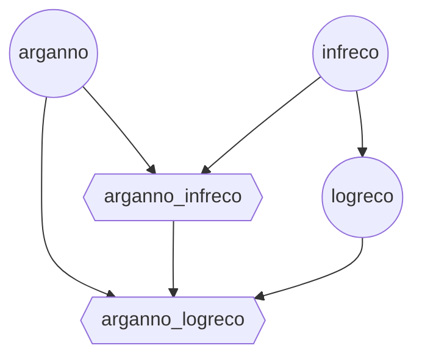
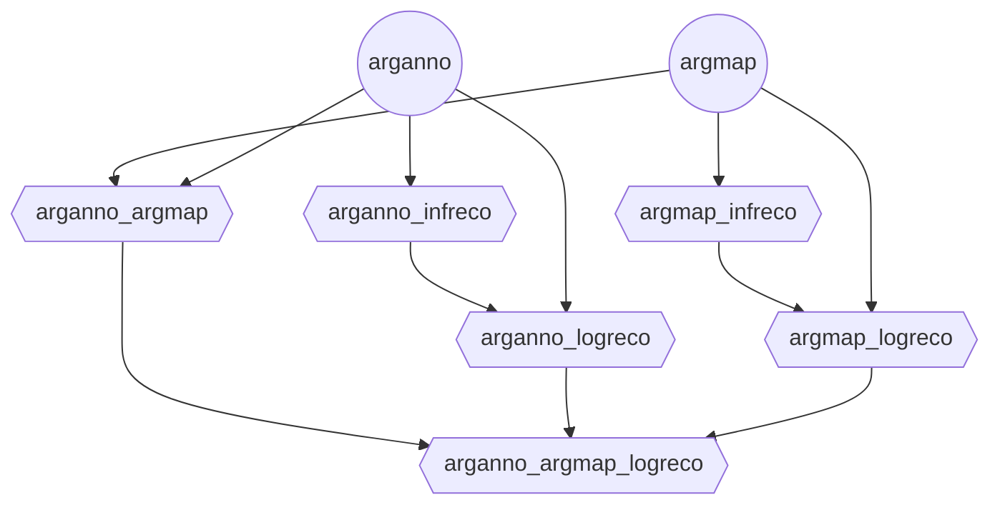

# Argdown Analysis Environment


## Tasks

Every node is a subtask that needs to be solved before the agent can proceed with the next node.

Once a subtask is completed, the environment chooses randomly a child node as next sub-task to solve.

### Single-Argument Analysis




```yaml
arganno:
    - arganno_infreco
    - arganno_logreco
infreco:
    - logreco
    - arganno_infreco
logreco: 
    - arganno_logreco
arganno_infreco:
    - arganno_logreco
```

### Multi-Argument-Analysis




```yaml
arganno:
    - arganno_argmap
    - arganno_infreco
    - arganno_logreco
argmap:
    - arganno_argmap
    - argmap_infreco
    - argmap_logreco
arganno_argmap:
    - arganno_argmap_logreco
arganno_infreco:
    - arganno_logreco
arganno_logreco:
    - arganno_argmap_logreco
argmap_infreco:
    - argmap_logreco
argmap_logreco:
    - arganno_argmap_logreco
```

-----

A simple test environment that echoes back messages. Perfect for testing the env APIs as well as demonstrating environment usage patterns.

## Quick Start

The simplest way to use the Argdown Analysis environment is through the `ArgdownAnalysisEnv` class:

```python
from argdown_analysis import ArgdownAnalysisAction, ArgdownAnalysisEnv

try:
    # Create environment from Docker image
    argdown_analysisenv = ArgdownAnalysisEnv.from_docker_image("argdown_analysis-env:latest")

    # Reset
    result = argdown_analysisenv.reset()
    print(f"Reset: {result.observation.echoed_message}")

    # Send multiple messages
    messages = ["Hello, World!", "Testing echo", "Final message"]

    for msg in messages:
        result = argdown_analysisenv.step(ArgdownAnalysisAction(message=msg))
        print(f"Sent: '{msg}'")
        print(f"  → Echoed: '{result.observation.echoed_message}'")
        print(f"  → Length: {result.observation.message_length}")
        print(f"  → Reward: {result.reward}")

finally:
    # Always clean up
    argdown_analysisenv.close()
```

That's it! The `ArgdownAnalysisEnv.from_docker_image()` method handles:
- Starting the Docker container
- Waiting for the server to be ready
- Connecting to the environment
- Container cleanup when you call `close()`

## Building the Docker Image

Before using the environment, you need to build the Docker image:

```bash
# From project root
docker build -t argdown_analysis-env:latest -f server/Dockerfile .
```

## Deploying to Hugging Face Spaces

You can easily deploy your OpenEnv environment to Hugging Face Spaces using the `openenv push` command:

```bash
# From the environment directory (where openenv.yaml is located)
openenv push

# Or specify options
openenv push --namespace my-org --private
```

The `openenv push` command will:
1. Validate that the directory is an OpenEnv environment (checks for `openenv.yaml`)
2. Prepare a custom build for Hugging Face Docker space (enables web interface)
3. Upload to Hugging Face (ensuring you're logged in)

### Prerequisites

- Authenticate with Hugging Face: The command will prompt for login if not already authenticated

### Options

- `--directory`, `-d`: Directory containing the OpenEnv environment (defaults to current directory)
- `--repo-id`, `-r`: Repository ID in format 'username/repo-name' (defaults to 'username/env-name' from openenv.yaml)
- `--base-image`, `-b`: Base Docker image to use (overrides Dockerfile FROM)
- `--private`: Deploy the space as private (default: public)

### Examples

```bash
# Push to your personal namespace (defaults to username/env-name from openenv.yaml)
openenv push

# Push to a specific repository
openenv push --repo-id my-org/my-env

# Push with a custom base image
openenv push --base-image ghcr.io/meta-pytorch/openenv-base:latest

# Push as a private space
openenv push --private

# Combine options
openenv push --repo-id my-org/my-env --base-image custom-base:latest --private
```

After deployment, your space will be available at:
`https://huggingface.co/spaces/<repo-id>`

The deployed space includes:
- **Web Interface** at `/web` - Interactive UI for exploring the environment
- **API Documentation** at `/docs` - Full OpenAPI/Swagger interface
- **Health Check** at `/health` - Container health monitoring

## Environment Details

### Action
**ArgdownAnalysisAction**: Contains a single field
- `message` (str) - The message to echo back

### Observation
**ArgdownAnalysisObservation**: Contains the echo response and metadata
- `echoed_message` (str) - The message echoed back
- `message_length` (int) - Length of the message
- `reward` (float) - Reward based on message length (length × 0.1)
- `done` (bool) - Always False for echo environment
- `metadata` (dict) - Additional info like step count

### Reward
The reward is calculated as: `message_length × 0.1`
- "Hi" → reward: 0.2
- "Hello, World!" → reward: 1.3
- Empty message → reward: 0.0

## Advanced Usage

### Connecting to an Existing Server

If you already have a Argdown Analysis environment server running, you can connect directly:

```python
from argdown_analysis import ArgdownAnalysisEnv

# Connect to existing server
argdown_analysisenv = ArgdownAnalysisEnv(base_url="<ENV_HTTP_URL_HERE>")

# Use as normal
result = argdown_analysisenv.reset()
result = argdown_analysisenv.step(ArgdownAnalysisAction(message="Hello!"))
```

Note: When connecting to an existing server, `argdown_analysisenv.close()` will NOT stop the server.

## Development & Testing

### Direct Environment Testing

Test the environment logic directly without starting the HTTP server:

```bash
# From the server directory
python3 server/argdown_analysis_environment.py
```

This verifies that:
- Environment resets correctly
- Step executes actions properly
- State tracking works
- Rewards are calculated correctly

### Running Locally

Run the server locally for development:

```bash
uvicorn server.app:app --reload
```

## Project Structure

```
argdown_analysis/
├── .dockerignore         # Docker build exclusions
├── __init__.py            # Module exports
├── README.md              # This file
├── openenv.yaml           # OpenEnv manifest
├── pyproject.toml         # Project metadata and dependencies
├── uv.lock                # Locked dependencies (generated)
├── client.py              # ArgdownAnalysisEnv client implementation
├── models.py              # Action and Observation models
└── server/
    ├── __init__.py        # Server module exports
    ├── argdown_analysis_environment.py  # Core environment logic
    ├── app.py             # FastAPI application
    └── Dockerfile         # Container image definition
```
